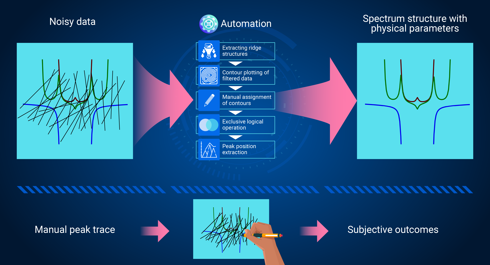

# scfitpy
for "Efficient spectrum analysis for multi-junction nonlinear superconducting circuit"

## What's this?


TBD

## Usage

### Installation

- via github
  1. `pip install "scfitpy[cupy] @ git+https://github.com/AkiyoshiTomonaga/scfitpy.git"`
- local install
  1. `git clone <this repo>`
  1. `pip install .[cupy]`
     - If you don't have a cuda environment, use `pip install .` instead. It doesn't install `cupy`.
- for development
  1. `git clone <this repo>`
  1. `uv sync --dev --extra cupy`

### Quick example

```python
from scfitpy import Qfit

... # 後で書く

```


### Advanced Usages

- `./notebooks/001_PeakTrace.ipynb`
- `./notebooks/101_RabiFit.ipynb`: TBD
- `./notebooks/102_4JJ_CircFit.ipynb`: TBD
- `./notebooks/201_RabiSpaceCheck.ipynb`: TBD
- `./notebooks/202_QspaceCheck.ipynb`: TBD
- `./notebooks/assets/*`: experimental data to be processed
- `notebooks/outs/*`: processed data

See the [./notebooks](notebooks) dir.
Each notebook corresponds to each step in the paper.


## Acknowledgements

- LINK to PAPER

- ACK to BUDGETS


## LICENSE

See the <LICENSE> file.

## Author information

The codes in this repository are written by [Akiyoshi Tomonaga](https://github.com/AkiyoshiTomonaga) and [Kosuke Mizuno](https://github.com/KosukeMizunoAIST).
